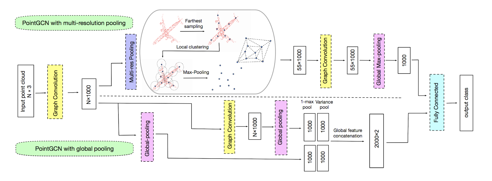
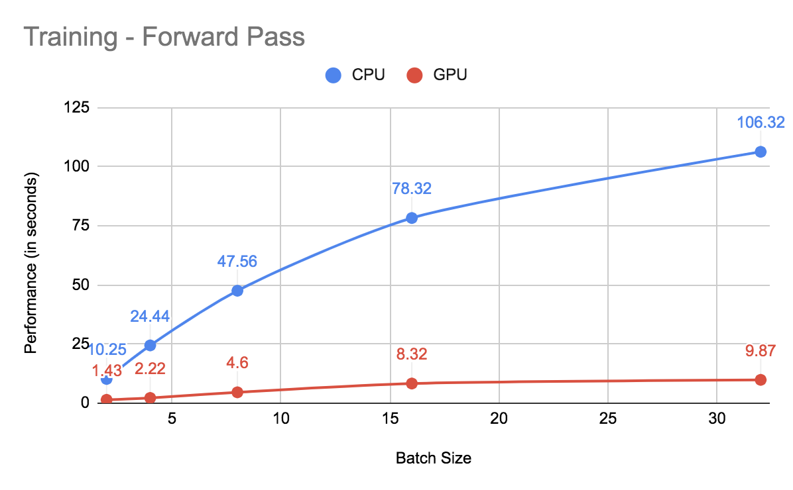
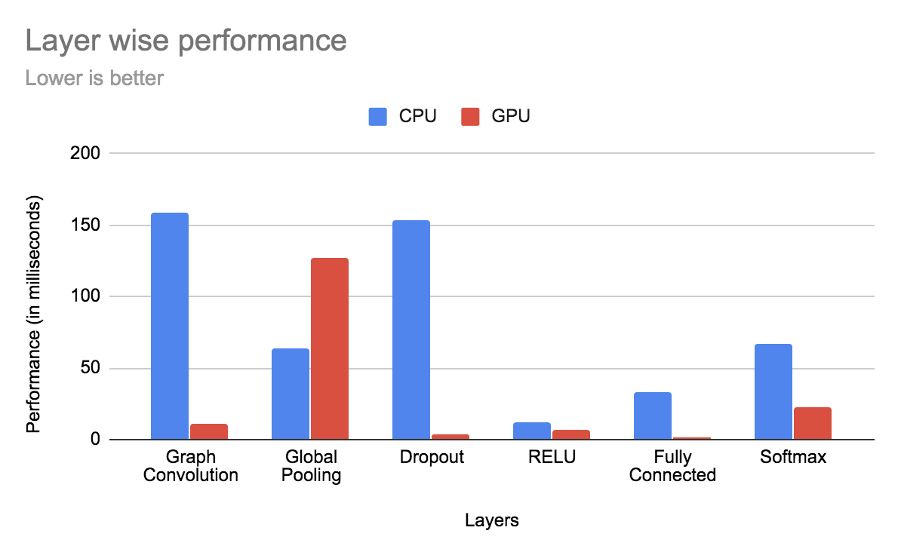
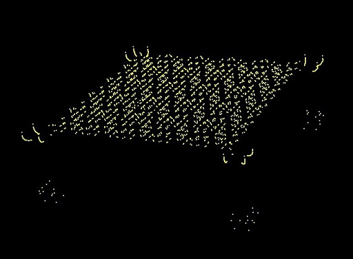
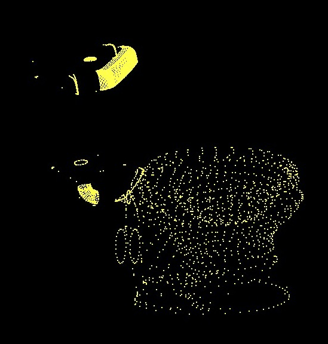

# Point Cloud Classification using Graph Convolutional Networks
**Team**: [Saket Karve](https://www.linkedin.com/in/saket-karve-43930511b/), [Disha Jindal](https://www.linkedin.com/in/disha-jindal/), [Kushagra Goel](https://www.linkedin.com/in/kushagragoel/)

[Proposal](./milestones/Proposal.pdf)
[Data](https://drive.google.com/file/d/1c2gZ2URDaMdimGsyt1sK17F6H6byQCMq/view?usp=sharing)

# Table of Contents

- Overview
- Data loading and Graph Generation
- Network Architecture
  - Layers
    - Graph Convolution Layer
    - Global Pooling Layer
    - Fully Connected Layer
   - Activation functions
     - ReLU
     - Sigmoid
     - Softmax
    - Regularization
      - Dropout
      - L2 regularization
    - Loss Functions
      - Cross Entropy Loss
- Performance Analysis
- Predictions from the network
- Point Wise Classification
- References
     

# Overview

In this project we have implemented 3D point cloud classification using Graph Convolutional Neural Networks on CUDA. Most of the 3D Point cloud data is obtained from LiDAR sensors especially in scenarios when the lighting is limited. In such settings, it is preferred to use point cloud data. Classifying such point cloud data is an important task for various applications such as detecting obstacles for drones. Rather than binning point clouds into voxels, graph-based approaches fit a graph with one vertex for each point and edges between nearby points, and then operate on the graph.

GCNs are very effective because they efficiently exploit the local structure in point clouds. The overall architecture involves nearest neighbor search to construct the graph from the point clouds.  Input to the network is a graph which propagates through the network preserving the graph structure across layers. The architecture we have implemented uses graph convolution layers  Graph neural networks are an ongoing topic of research and have applications in various fields. 

In this project, we have implemented a full end to end graph convolution network on GPU using CUDA and CPU as a benchmark for performance analysis. We also implemented an optimized version of various kernels performing reductions and matrix operations.

# Features Implemented

- Designed a framework for implementing any generic neural network architecture
- Farthest sampling of point clouds
- Graph generation of data on CPU and GPU
- CPU implementation of all layers
- GPU implementation of all layers
- Optimization of various kernels using memory optimiztion and streams

# Data Loading and Graph Generation

# Network Architecture

The above figure gives a higher level idea of the way the data will flow through the network. First, the point cloud data is used to construct a K-nearest neighbor graph (based on the euclidean distance between points). This graph is then input to the network which has a Graph Convolution Layer as the first layer. The input to this layer is a N x 3 matrix which is tranformed to a N x 1000 matrix. This is followed by another graph convolution layer which also outputs an N x 1000 matrix. The outputs of both these layers is passed through a Global Pooling layer which helps the network learn a latent representation summarizing each point cloud as a single point. The outputs of both the global pooling layers is the concatenated into one long vector which is then passed to the fully connected layers whic in the end output a class prediction. Dropout is used after both the graph convolution layers and also after the fully connected layers to avoid overfitting (so that the network does not memorize the training set but generalizes well). ReLU activation is also used to bring in non-linearity after the fully connected layers. The output of the last layer is passed through Softmax activation to get probabilities of classifying in each class. As this is a multi-class classification task, we use cross entropy loss. 

## Layers

### Graph Convolution Layer

We have implemented the Graph Convolution Layer as defined in the ChebNet paper. This layer takes two inputs - the actual input (X) which is some N x m matrix. In our case, N is the number of points (1024 after farthest sampling) and m is the x, y and z coordinates. So, m = 3. This layer also takes the Laplacian matrix of the graph which is constructed using the Adjecencey matrix of the graph as described above.

The forward pass of this network is defined using the Chebyshev Polynomials of order K (number of filters) - which is a tunable hyperparameter. The value of K is equivalent to the number of hops every node in the graph looks at during the forward pass. The following equation shows the forward pass for this layer.

Theta is the learnable parameter in this layer which is updated in the backward pass.

### Global Pooling Layer

### Fully Connected Layer

## Activation functions

### ReLU

### Sigmoid

### Softmax

## Regularization

### Dropout

### L2 regularization

## Loss Functions

### Cross Entropy Loss

# Performance Analysis

# Predictions from the network

 

The above input was predicted as a 'Table' by our network.

 

The above input was predicted as a 'Toilet' by our network.

# Point Wise Classification

To understand exactly how the network is learning the classes on the point clouds, we tried visualizing the point wise classification on each point cloud. We passed the point cloud through the network but now, instead of classifying the entire point cloud in a class, we tried to get the classification for each point. The way the graph convolution layers works (gathering some information in a smart manner from its neighbors), the classification of each point in thensame neighborhood is expected to predict the same class preferably the true class of the entire point cloud.

Some of these visualizations can be seen in the figures below. Each class is represented using a different color. So, if points have the same color, they are predicted in the same class.

As we can see, 

# References

[A Graph-CNN for 3D Point Cloud Classification](https://arxiv.org/pdf/1812.01711.pdf)

[Towards Efficient Large-Scale Graph Neural Network Computing](https://arxiv.org/pdf/1810.08403.pdf)

[Convolutional Neural Networks on Graphs with Fast Localized Spectral Filtering](https://arxiv.org/pdf/1606.09375.pdf)

[How to do Deep Learning on Graphs with Graph Convolutional Networks](https://towardsdatascience.com/how-to-do-deep-learning-on-graphs-with-graph-convolutional-networks-7d2250723780)

[KroneckerIntro](http://www.mathcs.emory.edu/~nagy/courses/fall10/515/KroneckerIntro.pdf)

# Tasks

| Task                | &#x265a;Saket&#x265a;  | 	&#x265b; Disha 	&#x265b; | &#x2654; Kushagra &#x2654;            |
| ---                 | ---    | ---        | ---                  |
|  RELUActivationLayerGPU    |   |       |              |  
|  crossEntropyLossGPU   |   |       |              |
|  fullyConnectedLayerGPU   |   |       |              |
|  globalPoolingGPU   |   |       |              |
|  graphConvolutionLayerGPU   |   |       |              |
|  sigmoidActivationLayerGPU   |   |       |              |
|  softmaxActivationLayerGPU   |   |       |              |
| Graph Convolution CPU Forward    | &#x2611;   |  |            |
| Droput CPU Forward    | | &#x2611;     |           |
| Dropout CPU Backward    |  | &#x2611;        |            |
| Global Pool CPU Forward    |   | &#x2611;       |            |
| Global Pool CPU Backward    |  | &#x2611;        |             |
| Eigen Math Library    | &#x25CB;  |    |           |
| Data Sampling    | |   | &#x2611;              |
| Data Loading    | |   | &#x2611;              |
| Label Loading    |  |    |  &#x2611;              |
| Architecture     |  |  &#x25CB;  |                |
| Train on CPU     |  |  &#x25CB;  |               |
| GPU kernels for Utils   |   |                | &#x25CB; |
| Layers on GPU   |    |                |    |

|Markdown Icon Legend                 | &#x2611; Completed    | &#x2612; Not Doing      |&#x25CB; Currently Working on            |  
| ---                 | ---    | ---        | ---                  |

