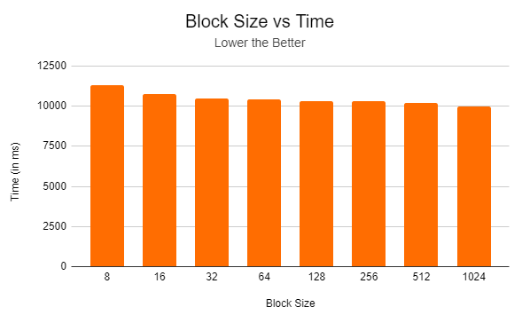
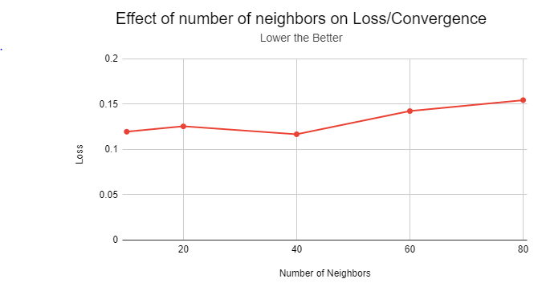

# Point Cloud Classification using Graph Convolutional Networks
**Team**: [Saket Karve](https://www.linkedin.com/in/saket-karve-43930511b/), [Disha Jindal](https://www.linkedin.com/in/disha-jindal/), [Kushagra Goel](https://www.linkedin.com/in/kushagragoel/)

[Proposal](./milestones/Proposal.pdf)

# Table of Contents

- Overview
- Data loading and Graph Generation
- Network Architecture
  - Layers
    - Graph Convolution Layer
    - Global Pooling Layer
    - Fully Connected Layer
   - Activation functions
     - ReLU
     - Sigmoid
     - Softmax
    - Regularization
      - Dropout
      - L2 regularization
    - Loss Functions
      - Cross Entropy Loss
- Performance Analysis
- Predictions from the network
- Point Wise Classification
- Code Walkthrough
- References
     

# Overview

In this project we have implemented 3D point cloud classification using Graph Convolutional Neural Networks on CUDA. Most of the 3D Point cloud data is obtained from LiDAR sensors especially in scenarios when the lighting is limited. In such settings, it is preferred to use point cloud data. Classifying such point cloud data is an important task for various applications such as detecting obstacles for drones. Rather than binning point clouds into voxels, graph-based approaches fit a graph with one vertex for each point and edges between nearby points, and then operate on the graph.

GCNs are very effective because they efficiently exploit the local structure in point clouds. The overall architecture involves nearest neighbor search to construct the graph from the point clouds.  Input to the network is a graph which propagates through the network preserving the graph structure across layers. The architecture we have implemented uses graph convolution layers  Graph neural networks are an ongoing topic of research and have applications in various fields. 

In this project, we have implemented a full end to end graph convolution network on GPU using CUDA and CPU as a benchmark for performance analysis. We also implemented an optimized version of various kernels performing reductions and matrix operations.

# Features Implemented

- [x] Designed a framework for implementing any generic neural network architecture
- [x] Farthest sampling of point clouds
- [x] Graph generation of data on CPU and GPU
- [x] CPU implementation of all layers
- [x] GPU implementation of all layers
- [x] Optimization of various kernels using memory optimiztion and streams

# Data Loading and Graph Generation

# Network Architecture


The above figure gives a higher level idea of the way the data will flow through the network. First, the point cloud data is used to construct a K-nearest neighbor graph (based on the euclidean distance between points). This graph is then input to the network which has a Graph Convolution Layer as the first layer. The input to this layer is a N x 3 matrix which is tranformed to a N x 1000 matrix. This is followed by another graph convolution layer which also outputs an N x 1000 matrix. The outputs of both these layers is passed through a Global Pooling layer which helps the network learn a latent representation summarizing each point cloud as a single point. The outputs of both the global pooling layers is the concatenated into one long vector which is then passed to the fully connected layers whic in the end output a class prediction. Dropout is used after both the graph convolution layers and also after the fully connected layers to avoid overfitting (so that the network does not memorize the training set but generalizes well). ReLU activation is also used to bring in non-linearity after the fully connected layers. The output of the last layer is passed through Softmax activation to get probabilities of classifying in each class. As this is a multi-class classification task, we use cross entropy loss. 

## Layers

### Graph Convolution Layer

We have implemented the Graph Convolution Layer as defined in the ChebNet paper. This layer takes two inputs - the actual input (X) which is some N x m matrix. In our case, N is the number of points (1024 after farthest sampling) and m is the x, y and z coordinates. So, m = 3. This layer also takes the Laplacian matrix of the graph which is constructed using the Adjecencey matrix of the graph as described above.

The forward pass of this network is defined using the Chebyshev Polynomials of order K (number of filters) - which is a tunable hyperparameter. The value of K is equivalent to the number of hops every node in the graph looks at during the forward pass. The following equation shows the forward pass for this layer.


Theta is the learnable parameter in this layer which is updated in the backward pass.

In the backward pass, we calculate the gradient of the loss with respect to the parameters (theta) to update them and with respect to the input to the layer which will be passed to the previous layer. The backward pass is implemented as per the following equations.


### Global Pooling Layer

This layer takes input of the form N x m (like the above layer) and performs essentially two operations. One, it takes the maximum of each column (max pooling) which outputs N x 1 matrix. Similarly we also take the variance of each colums to output a N x 1 matrix (variance pooling). Then these two matrixes are concatenated across the second dimension to get an N x 2 matrix.

The following diagrams explain the max-pooling and variance pooling operations more intuitively.


### Fully Connected Layer

This is the basic layer used in the traditional neural network. It simply transforms its input using a weight matrix - which is the learnable parameter of this layer.

The forward pass is implemented using the following equation.


In the backward pass, the gradient with respect to the weights is calculated as follows,


And the gradient with respect to the inout is cacluated as,


## Activation functions

These layer does not have any learnable parameters. This is used to introduce some non-linearity in the network since all other layers are essentially performing some linear operation on the input. This helps the network learn more complex functions.

### ReLU

In this layer all negative inputs are made 0 and positive inputs are kept as is. The following equation is implemented in the forward pass.


### Sigmoid

All inputs are converted in the range between 0 and 1. This layers implements the follwing equation in the forward pass.


### Softmax

This layer implements the following equation in the forward pass.


The output of this layer is such that the sum of each row is 1 and each element is between 0 and 1 (representing probabilities).

## Regularization

We do not want out model to memorize the inputs on which it is trained on. We want the model to generalize well on data it has not seen during trainineg. To avoid such memorization (also called as overfitting), we use different regularization techniques.

### Dropout

In this technique, we randomly drop some weights in the layer after which it is applied based on some probability.

### L2 regularization

## Loss Functions

### Cross Entropy Loss

Cross entropy loss is used for multi class classification tasks. The loss is calculated as follows,


The gradient of this loss with respect to the inputs (along with softmax) is given by the following equation,


# Analysis/Optimizations

## Speed Optimizations
First main component covered in the analysis is the performance analysis and optimizations. We played around with a number of different implementations and configurations to reach our final model. Following is the brief discription of each experiment:

### Graph Construction

<p align="center"> </p>  
We can see that the time taken for graph construction increases as number of points sampled points for both GPUs and CPUs. But we see a huge difference between the time taken by the CPU and the GPU which is expected due to significantly more cores in the GPU.

### Training - Forward Pass

<p align="center"> </p>  
As expected, we observe that time taken by the GPU is significantly lower than time taken by the CPU. The time taken with respect to batch-size doesn't increase much after 15 samples/batch as GPU is able to scale better as number of samples increases than the CPU as smaller batches are not fully utilizing the GPU's resources.


### Training - Backward Pass

<p align="center"> </p> 
Similar to the forward case, We see that bigger batches are better at optimally using the GPU's resources.

### Training - Layer wise Split

<p align="center"> </p>
In accordance with our expectation, implementing graph convolutions on GPU indeed is significantly faster than implementing on CPU due to the massive parallelization opportunities in the layer implementation. Since graph convolution uses matrix operations heavily, CUDA is able to accelerate it significantly. We observe similar stories with other layers too.

### Streams in Global Pooling Layer

<p align="center"> </p>  
We experimented with streams to improve speed by parallezing across batches, but it doesn't show significant improvements as we are already using very fast cuda operations and synchronising streams causes overheads to negate the benefits of streams for our use case.

### Block Size

<p align="center"> </p>  
We observe that block size indeed has an effect of improving time taken but the improvement is diminishing as we have more and more threads in a block.

## Hyper Parameter Tuning

### Number of Neighbors

<p align="center"> </p>  
Here we have noted the loss after a fixed number of epochs (large enough) for different number of neighbors considered. We see from our performance analysis, increasing number of neighbors increases the time for graph generation significantly. From this graph, we can see that having 40 neighbors gives us a good tradeoff between having a lower final loss and having fast enough graph generation.

### Learning Rate

<p align="center"> </p>  
In this chart we see that having too low (red) of a learning rate causes the network to learn very slowly whereas having too high (orange) of a learning rate makes the network saturate at a large loss value as the network cannot fine tune the parameters with enough granularity. So we decided to go with 0.01 learning rate as it provides us with fast enough convergence while still allowing enough granularity for the network to learn optimally.

# Predictions from the network

<p align="center"> </p>

The above input was predicted as a 'Table' by our network.

<p align="center"> </p>

The above input was predicted as a 'Toilet' by our network.

# Point Wise Classification

To understand exactly how the network is learning the classes on the point clouds, we tried visualizing the point wise classification on each point cloud. We passed the point cloud through the network but now, instead of classifying the entire point cloud in a class, we tried to get the classification for each point. The way the graph convolution layers works (gathering some information in a smart manner from its neighbors), the classification of each point in thensame neighborhood is expected to predict the same class preferably the true class of the entire point cloud.

Some of these visualizations can be seen in the figures below. Each class is represented using a different color. So, if points have the same color, they are predicted in the same class.


As we can see, 

# Code Walkthrough

```main.cpp``` : This file contains the main script. The network architecture is built here and the training function is called if you want to train the model. You can set te flags defined on top of this file to run in different modes (like test mode)

```point_cloud_classification/network.h``` : This file defines the network and related functions we have implemented. The train loop and inference functions are in this file.

```point_cloud_classification/hidden_layers``` : This folder contains the implementation of all layers used in the network. The framewor is designed such that we can easily add a new layer by just creating a class and implementing the forward and backward methods.

```point_cloud_classification/graph``` : This folder contains the code for reading data and constructing the graph (and laplacian matrix).

```point_cloud_classification/tests``` : This folder contains all the unit tests we implemented for all the layers and matrix operations. 

# References

[A Graph-CNN for 3D Point Cloud Classification](https://arxiv.org/pdf/1812.01711.pdf)

[Towards Efficient Large-Scale Graph Neural Network Computing](https://arxiv.org/pdf/1810.08403.pdf)

[Convolutional Neural Networks on Graphs with Fast Localized Spectral Filtering](https://arxiv.org/pdf/1606.09375.pdf)

[How to do Deep Learning on Graphs with Graph Convolutional Networks](https://towardsdatascience.com/how-to-do-deep-learning-on-graphs-with-graph-convolutional-networks-7d2250723780)

[KroneckerIntro](http://www.mathcs.emory.edu/~nagy/courses/fall10/515/KroneckerIntro.pdf)


